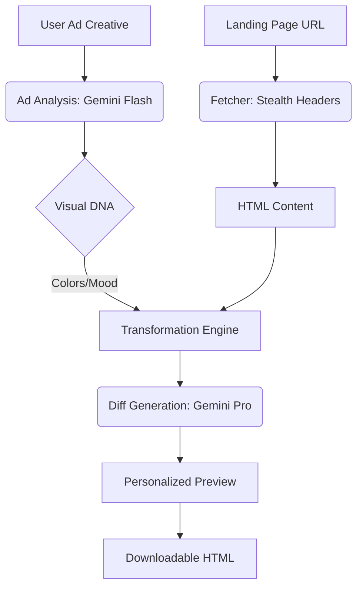

# AdMorph ✦ 

> **Close the Message-Match Gap.** AI-driven landing page personalization that aligns your brand’s visual DNA with every ad click, in seconds.

[](https://fastapi.tiangolo.com)
[](https://nextjs.org)
[](https://www.docker.com/)
[](https://render.com/)

---

## 🎯 What is AdMorph?

AdMorph eliminates the friction between a marketing ad and its destination. When a user clicks an ad for a "sleek dark-mode server," but lands on a "generic white-label light-mode" page, conversions drop.

AdMorph uses **Gemini Vision** to extract the "Visual DNA" of your ad (colors, mood, typography) and non-destructively personalizes your landing page to match-generating headlines, CTAs, and CSS overrides that ensure a perfect message match.

---

## ✨ Features

- 🧠 **Aesthetic Intelligence (Level 2)**: Extracts brand mood, primary colors, and visual "vibes" from any image ad.
- ⚡ **High-Fidelity Support**: Optimized to handle complex, modern landing pages and ad assets up to **30MB**.
- 🔒 **Non-Destructive Transformation**: Intelligently identifies and preserves "No-Go" zones like navigation, footers, and legal disclaimers.
- 🛡️ **Production Hardened**: Built-in SSRF guards, stealth headers, and bot/CAPTCHA detection.
- 📥 **Stand-alone Export**: Download your personalized variant as a single, ready-to-deploy HTML file.

---

## 🚀 Live Demo

**Frontend**: [https://admorph-frontend.onrender.com](https://admorph-frontend.onrender.com)  
**API Docs**: [https://admorph-backend.onrender.com/docs](https://admorph-backend.onrender.com/docs)  
**API Status**: [https://admorph-backend.onrender.com/api/status](https://admorph-backend.onrender.com/api/status)

---

## 🛠️ Tech Stack

| Layer | Technology |
|-------|-----------|
| **Frontend** | Next.js 14, TypeScript, Modern CSS/Glassmorphism |
| **Backend** | FastAPI (Python 3.12), Pydantic v2 |
| **AI Engine** | Gemini 1.5 Pro (Refining) & Gemini 1.5 Flash (Analysis) |
| **Parsing** | BeautifulSoup4 + lxml |
| **Infrastructure** | Docker + Render Blueprints |

---

## 🏗️ System Architecture



---

## 📦 Deployment (Render Blueprint)

AdMorph is designed for zero-config deployment via **Render Blueprints**.

1. **Connect**: Link your fork of this repo to Render.
2. **Environment**: Render will automatically detect `render.yaml`.
3. **Secrets**: 
   - Set `GOOGLE_API_KEY` in the Render dashboard.
   - `JWT_SECRET` is auto-generated for you.
4. **Deploy**: Click **Apply** and wait ~3 minutes for the build to finish.

---

## 🔧 Local Development

### 1. Configure
```bash
cp .env.example .env
# Fill in GOOGLE_API_KEY
```

### 2. Run (Docker)
```bash
docker compose up --build
```

### 3. Run (Manual)
**Backend:**
```bash
cd backend && pip install -r requirements.txt
uvicorn main:app --reload
```
**Frontend:**
```bash
cd frontend && npm install
npm run dev
```

---

## 📜 License

MIT License - Full details in [LICENSE](LICENSE) (if applicable).

---

> Built with ✦ by Anshuk Jirli
